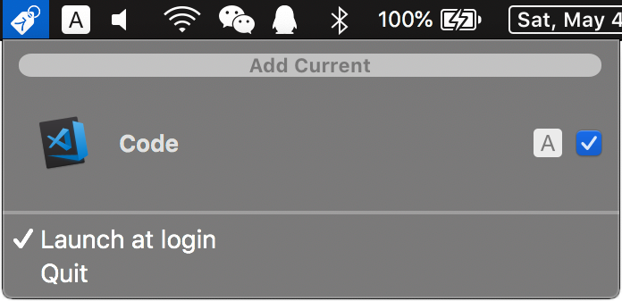
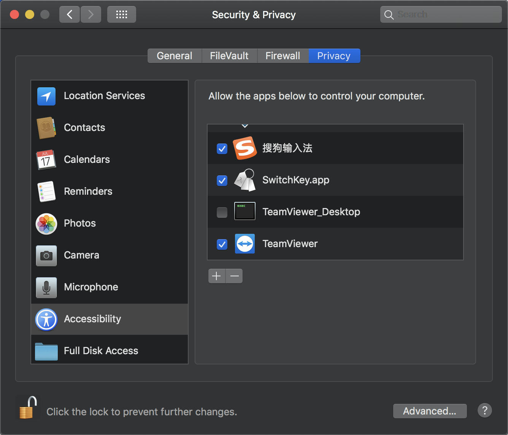

# SwitchKey

Automatically use the correct input source.

Ever hassled by wrong input source when switching application?  
SwitchKey can automatically activate your choice for you.

### Download & Install (Manaual)

[Version 1.1.2](https://github.com/itsuhane/SwitchKey/releases/download/v1.1.2/SwitchKey.zip) (macOS)  
Uncompress, then drag & drop into your Applications folder.

### Install With Homebrew

SwitchKey is also available from Homebrew-Cask (thanks to [@fanvinga](//github.com/fanvinga/)):

```
brew cask install switchkey
```

### Usage



- Save current input source choice for frontmost application:  
  click "Add Current".

- Enable/disable automatic switch for saved application:  
  check/uncheck the checkbox on the right.

- Remove saved choice:  
  select the one to be deleted, then press delete key.

Not working? See below.

### First Run

Upon first launch, SwitchKey will ask for accessibility permission.  
SwitchKey will open accessibility page, **and exit**.  
After you grant permission, re-launch SwitchKey again.  
The same will happen if you reject the permission later.



### Purchase

I wrote this because I tried some other tools.  
They are either buggy or too cumbersome to configure.  
I payed money and time for them.  
So you don't have to pay for them anymore.

### Bug Report & Feature Request

Welcome! Please click [here](https://github.com/itsuhane/SwitchKey/issues/new).
